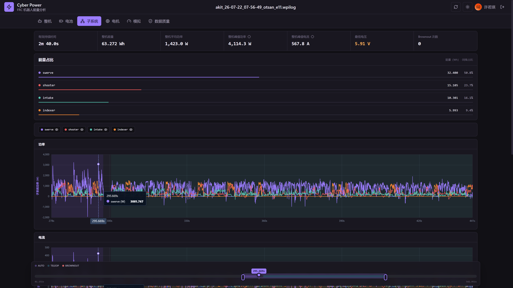
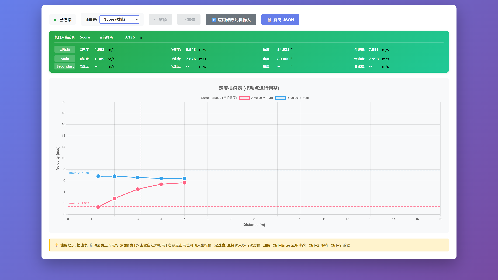

# FRC Team 8214 — 2026 Robot Code


English | [简体中文](README.zh-CN.md)


**MACK** — Team 8214's 2026 offseason robot.

Java robot code for MACK, FRC Team 8214's 2026 offseason robot. The project uses WPILib
Command-based, AdvantageKit, Phoenix 6, PhotonVision, Choreo, MapleSim, Autopilot, and
Cyber Power.

This repository is a read-only archive of FRC Team 8214's 2026 robot code.

## Engineering highlights

### Drivetrain and autonomous

- **Rotation-priority swerve:** When module speed is limited, MACK preserves turning
  authority and scales translation only as much as needed.
  ([Swerve.java#L401-L435](src/main/java/com/nextinnovation/team8214/subsystem/swerve/Swerve.java#L401-L435)
  · [Swerve.java#L696-L745](src/main/java/com/nextinnovation/team8214/subsystem/swerve/Swerve.java#L696-L745))
- **Dynamic center of rotation:** Before aiming, MACK checks its modeled footprint
  sweep against hub and trench geometry and can switch to a safer corner pivot.
  ([Swerve.java#L595-L670](src/main/java/com/nextinnovation/team8214/subsystem/swerve/Swerve.java#L595-L670)
  · [Field.java#L56-L76](src/main/java/com/nextinnovation/team8214/Field.java#L56-L76))
- **Gyroscope-based Bump crossing detection:** IMU tilt and travel progress confirm that the robot has
  climbed and settled, with independent overshoot and timeout stops.
  ([BumpPounceController.java#L111-L185](src/main/java/com/nextinnovation/team8214/subsystem/swerve/controller/BumpPounceController.java#L111-L185)
  · [AutoCommands.java#L102-L136](src/main/java/com/nextinnovation/team8214/command/AutoCommands.java#L102-L136))
- **Drive2PointController-based trajectory endpoint recovery:** Critical Choreo segments check the measured end pose
  and add a short convergence step only when needed.
  ([AutoCommands.java#L269-L320](src/main/java/com/nextinnovation/team8214/command/AutoCommands.java#L269-L320)
  · [AutoModes.java#L69-L79](src/main/java/com/nextinnovation/team8214/command/AutoModes.java#L69-L79))
- **Drivetrain acceleration limiting and energy management (Cyber-Power):** Layered limits cap axis, skid, and
  high-speed forward acceleration, while Cyber Power records motor current, rotor speed,
  connectivity, and battery voltage on the same timeline.
  ([Swerve.java#L747-L809](src/main/java/com/nextinnovation/team8214/subsystem/swerve/Swerve.java#L747-L809)
  · [Module.java#L51-L71](src/main/java/com/nextinnovation/team8214/subsystem/swerve/Module.java#L51-L71)
  · [Robot.java#L83-L87](src/main/java/com/nextinnovation/team8214/Robot.java#L83-L87))



### Mechanism and field safety

- **Predictive trench protection:** A 0.5-second pose lookahead detects an upcoming trench
  crossing and retracts the shooter before arrival.
  ([Odometry.java#L199-L215](src/main/java/com/nextinnovation/team8214/Odometry.java#L199-L215)
  · [Shooter.java#L270-L298](src/main/java/com/nextinnovation/team8214/subsystem/shooter/Shooter.java#L270-L298)
  · [Shooter.java#L380-L390](src/main/java/com/nextinnovation/team8214/subsystem/shooter/Shooter.java#L380-L390))
- **Automated early-shot decision:** Scoring timing accounts for shot flight and field counting
  delay, recovers after a mid-match reboot, and warns operators through alerts and rumble.
  ([HubShiftUtil.java#L35-L45](src/main/java/com/nextinnovation/team8214/HubShiftUtil.java#L35-L45)
  · [HubShiftUtil.java#L161-L200](src/main/java/com/nextinnovation/team8214/HubShiftUtil.java#L161-L200)
  · [RobotContainer.java#L447-L499](src/main/java/com/nextinnovation/team8214/RobotContainer.java#L447-L499))
- **Transport exclusion zone:** Alliance-aware field zones automatically block transport
  feeding where it is not allowed.
  ([Field.java#L84-L97](src/main/java/com/nextinnovation/team8214/Field.java#L84-L97)
  · [Odometry.java#L227-L240](src/main/java/com/nextinnovation/team8214/Odometry.java#L227-L240)
  · [RobotContainer.java#L337-L349](src/main/java/com/nextinnovation/team8214/RobotContainer.java#L337-L349))
- **Fail-safe shooting-table edits:** Invalid browser edits are rejected while the last
  valid shooting table remains active.
  ([ShootingCalculator.java#L32-L78](src/main/java/com/nextinnovation/team8214/subsystem/shooter/ShootingCalculator.java#L32-L78)
  · [ShootingCalculator.java#L203-L239](src/main/java/com/nextinnovation/team8214/subsystem/shooter/ShootingCalculator.java#L203-L239)
  · [ShootingCalculator.java#L399-L417](src/main/java/com/nextinnovation/team8214/subsystem/shooter/ShootingCalculator.java#L399-L417))
- **Online shooting-table tuning:** In live-debug builds, a Javalin-hosted editor uses
  NT4 topics to tune scoring, transport, and fence tables online; accepted edits are
  applied atomically.
  ([ShootingCalculator.java#L116-L200](src/main/java/com/nextinnovation/team8214/subsystem/shooter/ShootingCalculator.java#L116-L200)
  · [index.js#L1348-L1359](src/main/deploy/shootingcalculator/index.js#L1348-L1359)
  · [ShootingCalculator.java#L32-L78](src/main/java/com/nextinnovation/team8214/subsystem/shooter/ShootingCalculator.java#L32-L78))



### Simulation and tooling

- **Real-time robot physics updates from stored Fuel:** Stored Fuel changes robot mass and inertia, bump tilt affects
  gyro and projectile motion, and scored Fuel returns to the field.
  ([Sim.java#L192-L209](src/main/java/com/nextinnovation/team8214/Sim.java#L192-L209)
  · [Swerve.java#L211-L223](src/main/java/com/nextinnovation/team8214/subsystem/swerve/Swerve.java#L211-L223)
  · [Sim.java#L219-L327](src/main/java/com/nextinnovation/team8214/Sim.java#L219-L327))
- **Dual-instance Web Elastic:** Port-named launchers serve the bundled web dashboard on
  independent ports, allowing two local Elastic instances to run together.
  ([index.html#L1-L23](.elastic/index.html#L1-L23)
  · [elastic_launcher.go#L13-L48](.elastic/launcher/elastic_launcher.go#L13-L48)
  · [README.md#L17-L27](.elastic/README.md#L17-L27))

### Additional engineering details

- Stateless path following with SuperAutoPilot.
  ([SuperAutopilot.java#L43-L109](src/main/java/com/nextinnovation/team8214/util/superautopilot/SuperAutopilot.java#L43-L109)
  · [DriveToPointController.java#L181-L208](src/main/java/com/nextinnovation/team8214/subsystem/swerve/controller/DriveToPointController.java#L181-L208))
- One Choreo path can generate left/right and red/blue variants.
  ([TrajectoryLoader.java#L66-L105](src/main/java/com/nextinnovation/team8214/TrajectoryLoader.java#L66-L105)
  · [TrajectoryLoader.java#L108-L158](src/main/java/com/nextinnovation/team8214/TrajectoryLoader.java#L108-L158))
- Camera simulation models image quality, latency, a processed stream, and field-region tag
  visibility.
  ([ApriltagVisionCamera.java#L50-L80](src/main/java/com/nextinnovation/team8214/subsystem/vision/ApriltagVisionCamera.java#L50-L80)
  · [ApriltagVisionIOPhotonSim.java#L22-L34](src/main/java/com/nextinnovation/team8214/subsystem/vision/ApriltagVisionIOPhotonSim.java#L22-L34)
  · [ApriltagVisionIOPhotonSim.java#L36-L60](src/main/java/com/nextinnovation/team8214/subsystem/vision/ApriltagVisionIOPhotonSim.java#L36-L60))
- A question-based auto selector creates route variants without filling the dashboard with
  separate modes.
  ([AutoModeSelector.java#L21-L129](src/main/java/com/nextinnovation/team8214/AutoModeSelector.java#L21-L129)
  · [AutoModes.java#L198-L220](src/main/java/com/nextinnovation/team8214/command/AutoModes.java#L198-L220))
- Live tuning is enabled by subsystem group.
  ([Config.java#L14-L48](src/main/java/com/nextinnovation/team8214/Config.java#L14-L48)
  · [LoggedTunableNumber.java#L31-L49](src/main/java/com/nextinnovation/team8214/util/LoggedTunableNumber.java#L31-L49)
  · [Config.java#L105-L113](src/main/java/com/nextinnovation/team8214/Config.java#L105-L113))
- Subsystem pose solving with TransformTree.
  ([RobotContainer.java#L118-L136](src/main/java/com/nextinnovation/team8214/RobotContainer.java#L118-L136)
  · [Visualizer.java#L35-L78](src/main/java/com/nextinnovation/team8214/subsystem/Visualizer.java#L35-L78)
  · [config.json#L103-L136](.ascope/Robot_OFFSEASON2026/config.json#L103-L136))
- Idle shooter spin-up is bounded by field position and shooting-table range.
  ([IdleController.java#L22-L76](src/main/java/com/nextinnovation/team8214/subsystem/shooter/controller/IdleController.java#L22-L76)
  · [IdleController.java#L79-L86](src/main/java/com/nextinnovation/team8214/subsystem/shooter/controller/IdleController.java#L79-L86))
- Shooter readiness uses different speed rules for scoring and transport modes.
  ([Shooter.java#L350-L373](src/main/java/com/nextinnovation/team8214/subsystem/shooter/Shooter.java#L350-L373))

## Requirements

- WPILib 2026.2.1, including its bundled JDK 17
- Git
- Git LFS
- Windows, Linux, or macOS for normal builds; roboRIO deployment requires the WPILib toolchain

Clone with LFS content:

```bash
git lfs install
git clone <repository-url>
cd ni-8214-2026-public
git lfs pull
```

The MACK photo, PhotonVision ARM64 updater, and AdvantageScope GLB models are stored in
Git LFS. Pointer files are not usable assets; verify `git lfs status` before deployment or
release packaging.

## Build

Windows PowerShell:

```powershell
./gradlew.bat spotlessCheck
./gradlew.bat build
```

Linux or macOS:

```bash
./gradlew spotlessCheck
./gradlew build
```

`compileJava` currently applies Spotless formatting. Review the working tree after running it.

## Runtime modes

Select the mode in
[`Config.java`](src/main/java/com/nextinnovation/team8214/Config.java):

- `REAL`: roboRIO and real hardware
- `SIM`: local MapleSim/WPILib simulation
- `REPLAY`: AdvantageKit log replay

The archived release configuration is `REAL` with live debug disabled.

### Simulation

```powershell
./gradlew.bat simulateJava
```

Headless agent-auto validation:

```powershell
$env:AGENT_AUTO_NAME="Silence"
./gradlew.bat simulateJavaAgentAuto
```

### Replay

Set `Config.MODE` to `REPLAY`, then select a log in AdvantageScope or provide it explicitly:

```powershell
$env:AKIT_LOG_PATH="C:\path\to\input.wpilog"
./gradlew.bat replayOnce
```

`replayWatch` repeats replay after source changes.

### Deployment

Set `Config.MODE` to `REAL` before deploying:

```powershell
./gradlew.bat deploy
```

On branches named `event/*`, deploy tasks intentionally stage and commit all working-tree
changes before generating build metadata. Build, simulation, and replay tasks do not
invoke that event commit task.

## Asset usage

To use the AdvantageScope robot model, import `.ascope/layout.json` and copy the
`.ascope/Robot_OFFSEASON2026` folder into the AdvantageScope user assets directory.

The tracked `.elastic` directory is a standalone web bundle. Its numeric Windows launchers
serve the directory on the matching localhost port, as documented in
[`.elastic/README.md`](.elastic/README.md).

## License

Team 8214-authored code is distributed under the [MIT License](LICENSE).

Third-party dependencies, web source, assets, and binaries retain their original licenses.
See [THIRD_PARTY_NOTICES.md](THIRD_PARTY_NOTICES.md) and
[THIRD_PARTY_LICENSES](THIRD_PARTY_LICENSES). In particular, the WPILib entry point
retains its BSD-3-Clause terms, while bundled PhotonVision targeting and updater artifacts
contain GPLv3-licensed code and are not relicensed under the project MIT terms.
